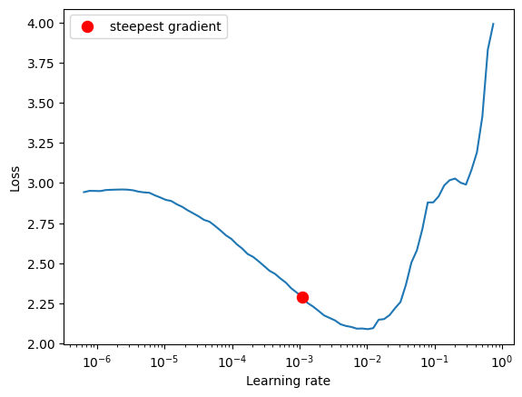
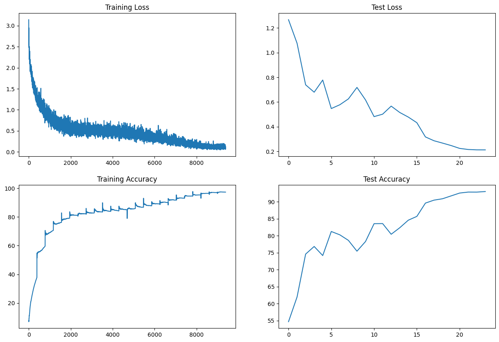

# Solution : TSAI_S10

## Problem Statement
    1. Write a ResNet architecture for CIFAR10 that has the following architecture: 
        1. PrepLayer - Conv 3x3 s1, p1) >> BN >> RELU [64k] 
        2. Layer1 - 
            1. X = Conv 3x3 (s1, p1) >> MaxPool2D >> BN >> RELU [128k] 
            2. R1 = ResBlock( (Conv-BN-ReLU-Conv-BN-ReLU))(X) [128k]  
            3. Add(X, R1) 
        3. Layer 2 - 
            1. Conv 3x3 [256k] 
            2. MaxPooling2D 
            3. BN 
            4. ReLU 
        4. Layer 3 - 
            1. X = Conv 3x3 (s1, p1) >> MaxPool2D >> BN >> RELU [512k] 
            2. R2 = ResBlock( (Conv-BN-ReLU-Conv-BN-ReLU))(X) [512k] 
            3. Add(X, R2) 
        5. MaxPooling with Kernel Size 4 
        6. FC Layer
        7. SoftMax 
    2. Uses One Cycle Policy such that: 
        1. Total Epochs = 24 
        2. Max at Epoch = 5 
        3. LRMIN = FIND 
        4. LRMAX = FIND 
        5. NO Annihilation 
    3. Uses this transform -RandomCrop 32, 32 (after padding of 4) >> FlipLR >> Followed by CutOut(8, 8) 
    4. Batch size = 512 
    5. Use ADAM, and CrossEntropyLoss 
    6. Target Accuracy: 90% 

## Introduction

Design and implement a ResNet architecture for CIFAR10 dataset with the objective of achieving a target accuracy of 90%. The architecture should follow the provided specifications and utilize the One Cycle Policy for optimization. Additionally, the transformation pipeline should include random cropping, flipping, and CutOut augmentation techniques. The training process should use a batch size of 512, the ADAM optimizer, and the CrossEntropyLoss function.

## Results
| Model Parameters | 6,573,130 |
| Train Accuracy | 97.25 % |
| Test Accuracy | **93.05** |

## Graphs & Curves

### LR Finder

### Train & Test Curves

## Misclassified Images

