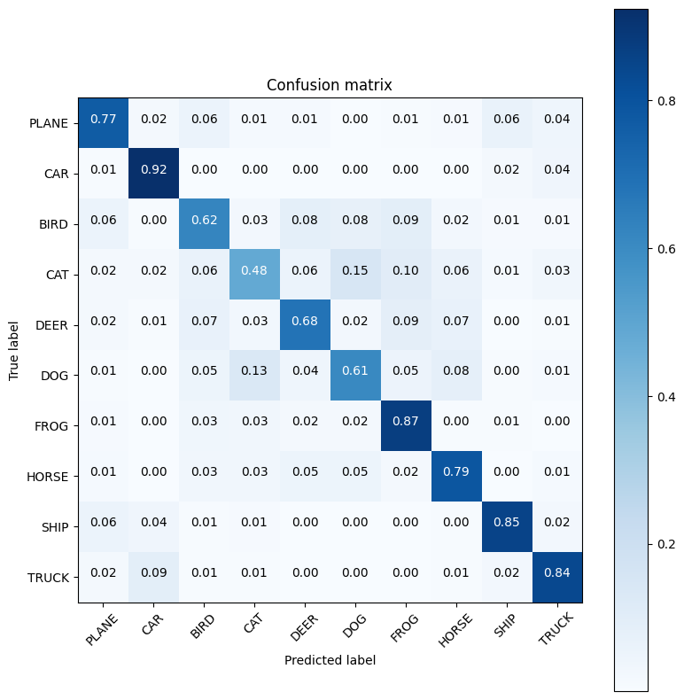

# This file shows how to use different normalization techniques

A network trained on CIfar 10 dataset using exact same network params and just using `BatchNormalization`, `GroupNormalization` and `LayerNormalization`

## Following are the outputs of three different techniques and their relative networks.

We will be showing following per technique
1. Network Architecture
2. Parameters And Model Summary
3. Model Performance
4. Training Logs
5. GradCam Output
6. Incorrect Predictions
7. Confusion Metrics

## Here is over all comparison between different techniques.


### Batch Normalization

<b>Network Architecture</b>


<b>Parameters And Model Summary</b>

```
----------------------------------------------------------------
Using Normalization: bn
Using 1*1 Skip Connection: True
Convolution Type: vanila
Number of Blocks Per Layer: 1
Use Dilation: False
----------------------------------------------------------------
        Layer (type)               Output Shape         Param #
================================================================
            Conv2d-1            [-1, 4, 32, 32]             108
          WyConv2d-2            [-1, 4, 32, 32]               0
       BatchNorm2d-3            [-1, 4, 32, 32]               8
            Conv2d-4            [-1, 8, 32, 32]             288
          WyConv2d-5            [-1, 8, 32, 32]               0
       BatchNorm2d-6            [-1, 8, 32, 32]              16
            Conv2d-7            [-1, 8, 32, 32]              64
          WyConv2d-8            [-1, 8, 32, 32]               0
            Conv2d-9            [-1, 8, 32, 32]              24
         WyConv2d-10            [-1, 8, 32, 32]               0
     WyResidualSE-11            [-1, 8, 32, 32]               0
        MaxPool2d-12            [-1, 8, 16, 16]               0
          WyBlock-13            [-1, 8, 16, 16]               0
           Conv2d-14           [-1, 16, 16, 16]           1,152
         WyConv2d-15           [-1, 16, 16, 16]               0
      BatchNorm2d-16           [-1, 16, 16, 16]              32
           Conv2d-17           [-1, 32, 16, 16]           4,608
         WyConv2d-18           [-1, 32, 16, 16]               0
      BatchNorm2d-19           [-1, 32, 16, 16]              64
           Conv2d-20           [-1, 16, 16, 16]             512
         WyConv2d-21           [-1, 16, 16, 16]               0
           Conv2d-22           [-1, 16, 16, 16]             128
         WyConv2d-23           [-1, 16, 16, 16]               0
     WyResidualSE-24           [-1, 16, 16, 16]               0
        MaxPool2d-25             [-1, 16, 8, 8]               0
          WyBlock-26             [-1, 16, 8, 8]               0
           Conv2d-27             [-1, 32, 8, 8]           4,608
         WyConv2d-28             [-1, 32, 8, 8]               0
      BatchNorm2d-29             [-1, 32, 8, 8]              64
           Conv2d-30             [-1, 64, 8, 8]          18,432
         WyConv2d-31             [-1, 64, 8, 8]               0
      BatchNorm2d-32             [-1, 64, 8, 8]             128
           Conv2d-33             [-1, 32, 8, 8]           2,048
         WyConv2d-34             [-1, 32, 8, 8]               0
           Conv2d-35             [-1, 32, 8, 8]             512
         WyConv2d-36             [-1, 32, 8, 8]               0
     WyResidualSE-37             [-1, 32, 8, 8]               0
          WyBlock-38             [-1, 32, 8, 8]               0
AdaptiveAvgPool2d-39             [-1, 32, 1, 1]               0
           Conv2d-40             [-1, 10, 1, 1]             330
================================================================
Total params: 33,126
Trainable params: 33,126
Non-trainable params: 0
----------------------------------------------------------------
Input size (MB): 0.01
Forward/backward pass size (MB): 1.31
Params size (MB): 0.13
Estimated Total Size (MB): 1.45
----------------------------------------------------------------
```

<b>Model Performance</b>


<b>Training Logs</b>

```
Using Device: cuda
Epochs: 20
Lr: 0.01
Max Lr: 0.1
Batch Size: 64
Dropout: False
Dropout Ratio: 0.01
Momentum: 0.9
Weight Decay: 1.953125e-06
Use L1: False
L1 Lambda: 1e-07
-------------------------------------------------------------------------
| Epoch | LR       | Time    | TrainLoss | TrainAcc | ValLoss  | ValAcc |
-------------------------------------------------------------------------
|     1 | 0.010000 | 00m 07s | 1.877089  | 29.44  % | 1.574787 | 41.77% |
|     2 | 0.028000 | 00m 06s | 1.56624   | 42.81  % | 1.458734 | 47.95% |
|     3 | 0.046000 | 00m 07s | 1.425219  | 48.73  % | 3.311775 | 28.27% |
|     4 | 0.064000 | 00m 06s | 1.343473  | 51.96  % | 1.489809 | 49.16% |
|     5 | 0.082000 | 00m 06s | 1.293784  | 53.76  % | 1.295842 | 54.62% |
|     6 | 0.100000 | 00m 06s | 1.235343  | 56.35  % | 1.239018 | 56.92% |
|     7 | 0.093367 | 00m 06s | 1.190031  | 57.78  % | 1.172300 | 60.14% |
|     8 | 0.086733 | 00m 06s | 1.135417  | 59.8   % | 0.954802 | 66.75% |
|     9 | 0.080100 | 00m 06s | 1.10768   | 61.13  % | 0.937499 | 67.26% |
|    10 | 0.073467 | 00m 06s | 1.074952  | 62.19  % | 1.073743 | 64.73% |
|    11 | 0.066833 | 00m 06s | 1.059281  | 62.87  % | 1.029869 | 65.45% |
|    12 | 0.060200 | 00m 07s | 1.031506  | 63.94  % | 0.838296 | 71.27% |
|    13 | 0.053567 | 00m 06s | 1.014739  | 64.31  % | 0.817514 | 72.31% |
|    14 | 0.046933 | 00m 07s | 0.993166  | 65.1   % | 0.840537 | 71.69% |
|    15 | 0.040300 | 00m 06s | 0.979264  | 65.73  % | 0.782983 | 72.89% |
|    16 | 0.033667 | 00m 06s | 0.953619  | 66.68  % | 0.771335 | 73.97% |
|    17 | 0.027033 | 00m 07s | 0.94259   | 66.81  % | 0.735163 | 75.38% |
|    18 | 0.020400 | 00m 06s | 0.928442  | 67.62  % | 0.701836 | 76.17% |
|    19 | 0.013767 | 00m 06s | 0.905017  | 68.11  % | 0.719694 | 75.55% |
|    20 | 0.007133 | 00m 06s | 0.887515  | 68.99  % | 0.680282 | 76.98% |
-------------------------------------------------------------------------
```

<b>GradCam Output</b>


<b>Incorrect Predictions</b>


<b>Confusion Matrix</b>


### Group Normalization

<b>Network Architecture</b>


<b>Parameters And Model Summary</b>

```
-------------------------------------------------------------------------
Using Normalization: gn
Using 1*1 Skip Connection: True
Convolution Type: vanila
Number of Blocks Per Layer: 1
Use Dilation: False
----------------------------------------------------------------
        Layer (type)               Output Shape         Param #
================================================================
            Conv2d-1            [-1, 4, 32, 32]             108
          WyConv2d-2            [-1, 4, 32, 32]               0
         GroupNorm-3            [-1, 4, 32, 32]               8
            Conv2d-4            [-1, 8, 32, 32]             288
          WyConv2d-5            [-1, 8, 32, 32]               0
         GroupNorm-6            [-1, 8, 32, 32]              16
            Conv2d-7            [-1, 8, 32, 32]              64
          WyConv2d-8            [-1, 8, 32, 32]               0
            Conv2d-9            [-1, 8, 32, 32]              24
         WyConv2d-10            [-1, 8, 32, 32]               0
     WyResidualSE-11            [-1, 8, 32, 32]               0
        MaxPool2d-12            [-1, 8, 16, 16]               0
          WyBlock-13            [-1, 8, 16, 16]               0
           Conv2d-14           [-1, 16, 16, 16]           1,152
         WyConv2d-15           [-1, 16, 16, 16]               0
        GroupNorm-16           [-1, 16, 16, 16]              32
           Conv2d-17           [-1, 32, 16, 16]           4,608
         WyConv2d-18           [-1, 32, 16, 16]               0
        GroupNorm-19           [-1, 32, 16, 16]              64
           Conv2d-20           [-1, 16, 16, 16]             512
         WyConv2d-21           [-1, 16, 16, 16]               0
           Conv2d-22           [-1, 16, 16, 16]             128
         WyConv2d-23           [-1, 16, 16, 16]               0
     WyResidualSE-24           [-1, 16, 16, 16]               0
        MaxPool2d-25             [-1, 16, 8, 8]               0
          WyBlock-26             [-1, 16, 8, 8]               0
           Conv2d-27             [-1, 32, 8, 8]           4,608
         WyConv2d-28             [-1, 32, 8, 8]               0
        GroupNorm-29             [-1, 32, 8, 8]              64
           Conv2d-30             [-1, 64, 8, 8]          18,432
         WyConv2d-31             [-1, 64, 8, 8]               0
        GroupNorm-32             [-1, 64, 8, 8]             128
           Conv2d-33             [-1, 32, 8, 8]           2,048
         WyConv2d-34             [-1, 32, 8, 8]               0
           Conv2d-35             [-1, 32, 8, 8]             512
         WyConv2d-36             [-1, 32, 8, 8]               0
     WyResidualSE-37             [-1, 32, 8, 8]               0
          WyBlock-38             [-1, 32, 8, 8]               0
AdaptiveAvgPool2d-39             [-1, 32, 1, 1]               0
           Conv2d-40             [-1, 10, 1, 1]             330
================================================================
Total params: 33,126
Trainable params: 33,126
Non-trainable params: 0
----------------------------------------------------------------
Input size (MB): 0.01
Forward/backward pass size (MB): 1.31
Params size (MB): 0.13
Estimated Total Size (MB): 1.45
----------------------------------------------------------------
```

<b>Model Performance</b>


<b>Training Logs</b>

```
Using Device: cuda
Epochs: 20
Lr: 0.01
Max Lr: 0.1
Batch Size: 64
Dropout: False
Dropout Ratio: 0.01
Momentum: 0.9
Weight Decay: 1.953125e-06
Use L1: False
L1 Lambda: 1e-07
-------------------------------------------------------------------------
| Epoch | LR       | Time    | TrainLoss | TrainAcc | ValLoss  | ValAcc |
-------------------------------------------------------------------------
|     1 | 0.010000 | 00m 07s | 1.981671  | 25.68  % | 1.685591 | 35.66% |
|     2 | 0.028000 | 00m 07s | 1.784236  | 34.57  % | 1.782092 | 36.19% |
|     3 | 0.046000 | 00m 06s | 1.656536  | 40.35  % | 1.965549 | 30.53% |
|     4 | 0.064000 | 00m 07s | 1.554778  | 44.28  % | 2.135424 | 35.6 % |
|     5 | 0.082000 | 00m 07s | 1.478948  | 47.31  % | 1.489184 | 47.5 % |
|     6 | 0.100000 | 00m 06s | 1.417396  | 49.49  % | 1.143576 | 58.63% |
|     7 | 0.093367 | 00m 07s | 1.346336  | 52.17  % | 1.100695 | 60.08% |
|     8 | 0.086733 | 00m 07s | 1.29683   | 53.96  % | 1.144952 | 59.73% |
|     9 | 0.080100 | 00m 06s | 1.254554  | 55.46  % | 1.294140 | 57.05% |
|    10 | 0.073467 | 00m 06s | 1.218277  | 57.36  % | 1.019796 | 63.95% |
|    11 | 0.066833 | 00m 06s | 1.183744  | 58.42  % | 0.991201 | 64.33% |
|    12 | 0.060200 | 00m 07s | 1.154814  | 59.19  % | 0.961522 | 66.01% |
|    13 | 0.053567 | 00m 07s | 1.124852  | 60.47  % | 0.938647 | 67.79% |
|    14 | 0.046933 | 00m 06s | 1.107368  | 61.25  % | 0.935478 | 67.44% |
|    15 | 0.040300 | 00m 06s | 1.077485  | 62.14  % | 0.863158 | 69.48% |
|    16 | 0.033667 | 00m 07s | 1.058082  | 62.85  % | 0.822006 | 71.76% |
|    17 | 0.027033 | 00m 06s | 1.035315  | 63.82  % | 0.806800 | 71.87% |
|    18 | 0.020400 | 00m 06s | 1.012555  | 64.51  % | 0.772544 | 72.74% |
|    19 | 0.013767 | 00m 06s | 0.986999  | 65.41  % | 0.769414 | 72.96% |
|    20 | 0.007133 | 00m 05s | 0.974978  | 65.81  % | 0.748130 | 73.84% |
-------------------------------------------------------------------------
```

<b>GradCam Output</b>


<b>Incorrect Predictions</b>


<b>Confusion Matrix</b>


### Layer Normalization

<b>Network Architecture</b>


<b>Parameters And Model Summary</b>

```
-------------------------------------------------------------------------
Using Normalization: ln
Using 1*1 Skip Connection: True
Convolution Type: vanila
Number of Blocks Per Layer: 1
Use Dilation: False
----------------------------------------------------------------
        Layer (type)               Output Shape         Param #
================================================================
            Conv2d-1            [-1, 4, 32, 32]             108
          WyConv2d-2            [-1, 4, 32, 32]               0
         GroupNorm-3            [-1, 4, 32, 32]               8
            Conv2d-4            [-1, 8, 32, 32]             288
          WyConv2d-5            [-1, 8, 32, 32]               0
         GroupNorm-6            [-1, 8, 32, 32]              16
            Conv2d-7            [-1, 8, 32, 32]              64
          WyConv2d-8            [-1, 8, 32, 32]               0
            Conv2d-9            [-1, 8, 32, 32]              24
         WyConv2d-10            [-1, 8, 32, 32]               0
     WyResidualSE-11            [-1, 8, 32, 32]               0
        MaxPool2d-12            [-1, 8, 16, 16]               0
          WyBlock-13            [-1, 8, 16, 16]               0
           Conv2d-14           [-1, 16, 16, 16]           1,152
         WyConv2d-15           [-1, 16, 16, 16]               0
        GroupNorm-16           [-1, 16, 16, 16]              32
           Conv2d-17           [-1, 32, 16, 16]           4,608
         WyConv2d-18           [-1, 32, 16, 16]               0
        GroupNorm-19           [-1, 32, 16, 16]              64
           Conv2d-20           [-1, 16, 16, 16]             512
         WyConv2d-21           [-1, 16, 16, 16]               0
           Conv2d-22           [-1, 16, 16, 16]             128
         WyConv2d-23           [-1, 16, 16, 16]               0
     WyResidualSE-24           [-1, 16, 16, 16]               0
        MaxPool2d-25             [-1, 16, 8, 8]               0
          WyBlock-26             [-1, 16, 8, 8]               0
           Conv2d-27             [-1, 32, 8, 8]           4,608
         WyConv2d-28             [-1, 32, 8, 8]               0
        GroupNorm-29             [-1, 32, 8, 8]              64
           Conv2d-30             [-1, 64, 8, 8]          18,432
         WyConv2d-31             [-1, 64, 8, 8]               0
        GroupNorm-32             [-1, 64, 8, 8]             128
           Conv2d-33             [-1, 32, 8, 8]           2,048
         WyConv2d-34             [-1, 32, 8, 8]               0
           Conv2d-35             [-1, 32, 8, 8]             512
         WyConv2d-36             [-1, 32, 8, 8]               0
     WyResidualSE-37             [-1, 32, 8, 8]               0
          WyBlock-38             [-1, 32, 8, 8]               0
AdaptiveAvgPool2d-39             [-1, 32, 1, 1]               0
           Conv2d-40             [-1, 10, 1, 1]             330
================================================================
Total params: 33,126
Trainable params: 33,126
Non-trainable params: 0
----------------------------------------------------------------
Input size (MB): 0.01
Forward/backward pass size (MB): 1.31
Params size (MB): 0.13
Estimated Total Size (MB): 1.45
----------------------------------------------------------------
```

<b>Model Performance</b>


<b>Training Logs</b>

```
Using Device: cuda
Epochs: 20
Lr: 0.01
Max Lr: 0.1
Batch Size: 64
Dropout: False
Dropout Ratio: 0.01
Momentum: 0.9
Weight Decay: 1.953125e-06
Use L1: False
L1 Lambda: 1e-07
-------------------------------------------------------------------------
| Epoch | LR       | Time    | TrainLoss | TrainAcc | ValLoss  | ValAcc |
-------------------------------------------------------------------------
|     1 | 0.010000 | 00m 06s | 2.012392  | 23.13  % | 1.734324 | 36.09% |
|     2 | 0.028000 | 00m 06s | 1.828782  | 32.03  % | 2.156555 | 25.13% |
|     3 | 0.046000 | 00m 06s | 1.684768  | 38.53  % | 1.560382 | 44.58% |
|     4 | 0.064000 | 00m 07s | 1.575722  | 43.23  % | 1.981054 | 38.64% |
|     5 | 0.082000 | 00m 07s | 1.503234  | 45.82  % | 1.907010 | 38.14% |
|     6 | 0.100000 | 00m 07s | 1.445009  | 48.5   % | 1.249885 | 55.35% |
|     7 | 0.093367 | 00m 06s | 1.363613  | 51.55  % | 1.297799 | 54.25% |
|     8 | 0.086733 | 00m 06s | 1.305399  | 53.73  % | 1.009145 | 64.38% |
|     9 | 0.080100 | 00m 06s | 1.258396  | 55.64  % | 1.077906 | 62.79% |
|    10 | 0.073467 | 00m 06s | 1.216752  | 57.05  % | 1.067396 | 62.97% |
|    11 | 0.066833 | 00m 06s | 1.179327  | 58.33  % | 1.813288 | 45.65% |
|    12 | 0.060200 | 00m 07s | 1.154132  | 59.38  % | 0.891831 | 68.74% |
|    13 | 0.053567 | 00m 07s | 1.125437  | 60.37  % | 0.920930 | 67.53% |
|    14 | 0.046933 | 00m 06s | 1.102088  | 61.3   % | 0.850548 | 69.86% |
|    15 | 0.040300 | 00m 06s | 1.07802   | 62.22  % | 0.820390 | 71.31% |
|    16 | 0.033667 | 00m 06s | 1.052008  | 63.05  % | 0.835193 | 70.73% |
|    17 | 0.027033 | 00m 07s | 1.035714  | 63.68  % | 0.857468 | 69.92% |
|    18 | 0.020400 | 00m 06s | 1.009554  | 64.56  % | 0.740919 | 74.26% |
|    19 | 0.013767 | 00m 06s | 0.984727  | 65.48  % | 0.771777 | 72.81% |
|    20 | 0.007133 | 00m 06s | 0.966986  | 66.15  % | 0.736123 | 74.37% |
-------------------------------------------------------------------------
```

<b>GradCam Output</b>


<b>Incorrect Predictions</b>


<b>Confusion Matrix</b>


